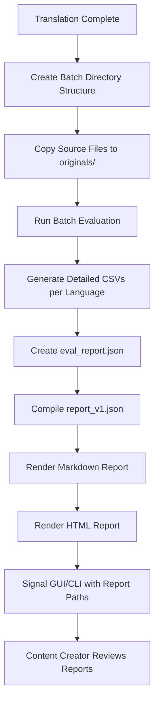

# Post-Translation Evaluation and Reporting Workflow

This document explains the complete workflow that occurs after core translation has finished, through to the generation of the final output folder ready for content creator review.

## Overview

After the core translation process completes, the system automatically runs a comprehensive evaluation and reporting pipeline that:

1. **Evaluates translation quality** by analyzing source/target file pairs
2. **Detects specific issues** like missing translations, DNT violations, and timing problems
3. **Generates detailed reports** in multiple formats (JSON, Markdown, HTML)
4. **Creates a complete audit trail** with CSV data for technical analysis

## High-Level Workflow



## Detailed Step-by-Step Process

### Phase 1: Post-Translation Setup

#### 1.1 Batch Directory Creation
**Location**: `srt_translator/core/main.py:translate_srt_files()`

The system creates a timestamped batch directory:
```
translation-batch-20240115_143022_+0000/
├── originals/           # Source files (created here)
├── targets/            # Translated files (created during translation)
│   ├── fr/             # French translations
│   ├── ja/             # Japanese translations
│   └── es/             # Spanish translations
├── artifacts/          # Evaluation outputs (created here)
└── translation_issues_20240115_143022_+0000.log
```

#### 1.2 AI Configuration Writing
**Location**: `srt_translator/core/main.py:translate_srt_files()`

Creates `artifacts/ai_config.json` containing:
- Translation settings used
- DNT terms applied
- Termbases used per language
- Batch sizes and other metadata

#### 1.3 Source File Preparation
**Location**: `srt_translator/core/main.py:translate_srt_files()`

Copies original SRT files to `originals/` directory for evaluation comparison.

### Phase 2: Evaluation Execution

#### 2.1 Evaluation Trigger
**Location**: `srt_translator/gui/workers/translation_worker.py:run()`

The GUI worker automatically calls:
```python
rollup = run_batch_evaluation(
    batch_root=latest_batch,
    logger=eval_logger,
    language_config=api_cfg,
)
```

#### 2.2 Batch Evaluation Process
**Location**: `srt_translator/eval/runner.py:run_batch_evaluation()`

For each language directory in `targets/`:

1. **File Pair Discovery**: Matches source files in `originals/` with translated files in `targets/{lang}/`
2. **Per-Pair Evaluation**: Calls `evaluate_pair()` for each source/target file pair
3. **Issue Detection**: Identifies three types of problems:
   - **Missing Translation**: Empty or placeholder-only target lines
   - **DNT Violations**: Terms that should not be translated but were
   - **Timing Failures**: Subtitle timing that doesn't match source

#### 2.3 Detailed CSV Generation
**Location**: `srt_translator/eval/tools.py:evaluate_pair()`

For each file pair, creates detailed CSV files in `artifacts/{lang}/`:

- **`timing_{lang}_{batch}.csv`**: Timing differences between source and target
- **`cps_{lang}_{batch}.csv`**: Characters per second analysis
- **`dnt_coverage_{lang}_{batch}.csv`**: DNT term preservation statistics
- **`termbase_coverage_{lang}_{batch}.csv`**: Termbase usage statistics
- **`untranslated_{lang}_{batch}.csv`**: DNT violation details
- **`source_fragments_{lang}_{batch}.csv`**: Untranslated English fragments
- **`eval_summary_{lang}_{batch}.md`**: Per-language evaluation summary

### Phase 3: Report Generation

#### 3.1 Raw Data Compilation
**Location**: `srt_translator/eval/report.py:_write_json_report()`

Converts detailed evaluation data into standardized `eval_report.json`:
```json
{
  "files_total": 3,
  "languages_total": 2,
  "issues_total": 4,
  "source_language": "en",
  "languages": {
    "fr": {
      "files": {
        "file1.srt": {
          "missing_translation": 1,
          "untranslated_after_dnt": 0,
          "timing_fail": 0
        }
      }
    }
  }
}
```

#### 3.2 Human-Friendly Report Compilation
**Location**: `srt_translator/report/compiler.py:compile_report()`

Transforms raw data into `report_v1.json` with:
- **Decision level**: pass/review/fix
- **One-liner summary**: Human-readable status
- **Punch list**: Detailed error/warning records with context
- **File status**: Per-file readiness indicators
- **KPIs**: Summary statistics
- **Lexicons**: DNT and termbase information

#### 3.3 Report Rendering
**Location**: `srt_translator/eval/report.py:emit_all_reports()`

Generates final reports:
- **`eval_report.md`**: Markdown report for technical review
- **`eval_report.html`**: HTML report for content creator review

### Phase 4: GUI/CLI Integration

#### 4.1 Signal Emission
**Location**: `srt_translator/gui/workers/translation_worker.py:run()`

The worker emits signals with all report paths:
```python
self.eval_report_ready.emit({
    "eval_report_json": path,
    "report_v1_json": path,
    "eval_report_md": path,
    "eval_report_html": path
})
```

#### 4.2 GUI Response
**Location**: `srt_translator/gui/main_window.py:_after_eval_finished()`

The GUI:
- Logs all report paths
- Enables "Open HTML Report" button
- Stores paths for later access

## Complete File Inventory

### Batch Root Directory
```
translation-batch-20240115_143022_+0000/
├── originals/                                    # Source files for evaluation
│   ├── file1.srt                                # Original English subtitles
│   ├── file2.srt
│   └── file3.srt
├── targets/                                      # Translated files
│   ├── fr/                                      # French translations
│   │   ├── file1.srt
│   │   └── file2.srt
│   ├── ja/                                      # Japanese translations
│   │   ├── file1.srt
│   │   └── file3.srt
│   └── es/                                      # Spanish translations
│       ├── file1.srt
│       └── file2.srt
├── artifacts/                                   # Evaluation outputs
│   ├── ai_config.json                           # Translation configuration used
│   ├── eval_report.json                         # Raw evaluation data
│   ├── report_v1.json                           # Compiled human-friendly data
│   ├── eval_report.md                           # Markdown report
│   ├── eval_report.html                         # HTML report for content creators
│   ├── fr/                                      # French evaluation details
│   │   ├── timing_fr_batch.csv                  # Timing analysis
│   │   ├── cps_fr_batch.csv                     # Characters per second
│   │   ├── dnt_coverage_fr_batch.csv            # DNT preservation stats
│   │   ├── termbase_coverage_fr_batch.csv       # Termbase usage stats
│   │   ├── untranslated_fr_batch.csv            # DNT violations
│   │   ├── source_fragments_fr_batch.csv        # Untranslated fragments
│   │   └── eval_summary_fr_batch.md             # Per-language summary
│   ├── ja/                                      # Japanese evaluation details
│   │   ├── timing_ja_batch.csv
│   │   ├── cps_ja_batch.csv
│   │   ├── dnt_coverage_ja_batch.csv
│   │   ├── termbase_coverage_ja_batch.csv
│   │   ├── untranslated_ja_batch.csv
│   │   ├── source_fragments_ja_batch.csv
│   │   └── eval_summary_ja_batch.md
│   └── es/                                      # Spanish evaluation details
│       ├── timing_es_batch.csv
│       ├── cps_es_batch.csv
│       ├── dnt_coverage_es_batch.csv
│       ├── termbase_coverage_es_batch.csv
│       ├── untranslated_es_batch.csv
│       ├── source_fragments_es_batch.csv
│       └── eval_summary_es_batch.md
└── translation_issues_20240115_143022_+0000.log # Translation process log
```

## File Purpose Descriptions

### Core Configuration Files

#### `artifacts/ai_config.json`
**Purpose**: Complete snapshot of translation configuration
**Contents**:
- Version and timestamp
- Source files processed
- Target languages
- DNT terms used
- Termbases per language
- Batch sizes applied
- Aggressiveness settings

#### `translation_issues_20240115_143022_+0000.log`
**Purpose**: Complete log of translation process
**Contents**:
- Translation progress
- Error messages
- Fixer operations
- API calls and responses

### Evaluation Data Files

#### `artifacts/eval_report.json`
**Purpose**: Raw evaluation data in standardized format
**Contents**:
- File counts and language counts
- Issue counts per file per language
- Source language detection
- Machine-readable format for further processing

#### `artifacts/report_v1.json`
**Purpose**: Human-friendly compiled evaluation data
**Contents**:
- Decision level (pass/review/fix)
- One-liner summary
- Detailed punch list with context
- File status indicators
- KPI summaries
- Lexicon information

### Content Creator Reports

#### `artifacts/eval_report.html`
**Purpose**: Primary report for content creator review
**Contents**:
- Visual decision banner
- Detailed issue list with suggested fixes
- File status by language
- KPI dashboard
- Lexicon summaries
- Professional formatting for easy review

#### `artifacts/eval_report.md`
**Purpose**: Markdown version for technical review
**Contents**:
- Same information as HTML but in markdown format
- Suitable for version control
- Easy to read in text editors
- Can be converted to other formats

### Detailed Analysis Files (Per Language)

#### `artifacts/{lang}/timing_{lang}_batch.csv`
**Purpose**: Timing synchronization analysis
**Contents**:
- Cue-by-cue timing comparisons
- Start/end time differences
- Identifies timing drift issues

#### `artifacts/{lang}/cps_{lang}_batch.csv`
**Purpose**: Reading speed analysis
**Contents**:
- Characters per second for each subtitle
- Identifies overly fast/slow subtitles
- Helps ensure readability

#### `artifacts/{lang}/dnt_coverage_{lang}_batch.csv`
**Purpose**: DNT term preservation analysis
**Contents**:
- Which DNT terms appeared in source
- How many were preserved in target
- Preservation percentage per term

#### `artifacts/{lang}/termbase_coverage_{lang}_batch.csv`
**Purpose**: Termbase usage analysis
**Contents**:
- Which termbase entries were used
- Usage frequency
- Coverage statistics

#### `artifacts/{lang}/untranslated_{lang}_batch.csv`
**Purpose**: DNT violation details
**Contents**:
- Specific lines where DNT terms were translated
- Source and target text
- Cue indices for easy location

#### `artifacts/{lang}/source_fragments_{lang}_batch.csv`
**Purpose**: Untranslated English fragments
**Contents**:
- English text that wasn't translated
- Helps identify incomplete translations
- Useful for quality control

#### `artifacts/{lang}/eval_summary_{lang}_batch.md`
**Purpose**: Per-language evaluation summary
**Contents**:
- Pass/fail verdict for the language
- Specific failure reasons
- Quick overview of issues

## Content Creator Review Process

### 1. Primary Review: HTML Report
The content creator opens `artifacts/eval_report.html` which provides:
- **Clear decision**: Pass, Review, or Fix required
- **Issue summary**: Number of errors and warnings
- **Actionable items**: Specific files and lines to check
- **Suggested fixes**: Clear instructions for each issue
- **File status**: Visual indicators of which files are ready

### 2. Technical Deep Dive: CSV Files
For detailed analysis, the creator can examine:
- **Timing issues**: Check `timing_{lang}_batch.csv` for synchronization problems
- **DNT violations**: Review `untranslated_{lang}_batch.csv` for terms that shouldn't be translated
- **Reading speed**: Analyze `cps_{lang}_batch.csv` for subtitle pacing
- **Coverage gaps**: Check `dnt_coverage_{lang}_batch.csv` for missing term preservation

### 3. Batch-Level Analysis: JSON Files
For programmatic analysis or integration:
- **`eval_report.json`**: Raw data for custom processing
- **`report_v1.json`**: Structured data with human-friendly summaries
- **`ai_config.json`**: Complete configuration audit trail

## Error Handling and Recovery

### Evaluation Failures
If evaluation fails:
- Error is logged in the translation log
- GUI shows error message
- No reports are generated
- Batch directory remains for manual inspection

### Missing Dependencies
If required files are missing:
- System fails fast with clear error messages
- No partial reports are generated
- User is directed to check file structure

### Report Generation Failures
If report compilation fails:
- Error is logged with specific details
- Partial data may be available in `eval_report.json`
- User can manually inspect CSV files for analysis

## Performance Considerations

### Evaluation Speed
- Evaluation runs in parallel for multiple languages
- CSV generation is optimized for large files
- Memory usage is controlled through streaming

### Storage Requirements
- CSV files provide detailed analysis but use minimal space
- HTML/JSON reports are optimized for readability
- Log files are rotated to prevent excessive growth

### Scalability
- Process scales linearly with number of files and languages
- Memory usage remains constant regardless of batch size
- Can handle batches with hundreds of files and multiple languages

This workflow ensures that content creators receive comprehensive, actionable feedback on their translations while maintaining detailed audit trails for quality control and process improvement.
