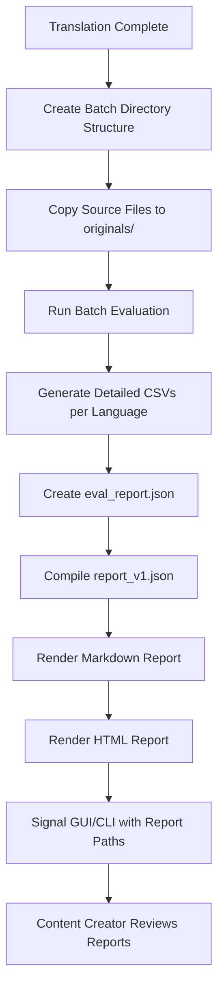

# Post-Translation Evaluation and Reporting Workflow

This document explains the complete workflow that occurs after core translation has finished, through to the generation of the final output folder ready for content creator review.

## Overview

After the core translation process completes, the system automatically runs a comprehensive evaluation and reporting pipeline that:

1. **Evaluates translation quality** by analyzing source/target file pairs
2. **Detects specific issues** like missing translations, DNT violations, and timing problems
3. **Generates detailed reports** in multiple formats (JSON, Markdown, HTML)
4. **Creates a complete audit trail** with CSV data for technical analysis

## High-Level Workflow



## Detailed Step-by-Step Process

### Phase 1: Post-Translation Setup

#### 1.1 Batch Directory Creation
**Location**: `srt_translator/core/main.py:translate_srt_files()`

The system creates a timestamped batch directory:
```
translation-batch-20240115_143022_+0000/
├── originals/           # Source files (created here)
├── fr/                  # French translations
├── ja/                  # Japanese translations
├── es/                  # Spanish translations
├── artifacts/          # Evaluation outputs (created here)
└── translation_issues_20240115_143022_+0000.log
```

#### 1.2 AI Configuration Writing
**Location**: `srt_translator/core/main.py:translate_srt_files()`

Creates `artifacts/ai_config.json` containing:
- Translation settings used
- DNT terms applied
- Termbases used per language
- Batch sizes and other metadata

#### 1.3 Source File Preparation
**Location**: `srt_translator/core/main.py:translate_srt_files()`

Copies original SRT files to `originals/` directory for evaluation comparison.

### Phase 2: Evaluation Execution

#### 2.1 Evaluation Trigger
**Location**: `srt_translator/gui/workers/translation_worker.py:run()`

The GUI worker automatically calls:
```python
rollup = run_batch_evaluation(
    batch_root=latest_batch,
    logger=eval_logger,
    language_config=api_cfg,
)
```

#### 2.2 Batch Evaluation Process
**Location**: `srt_translator/eval/runner.py:run_batch_evaluation()`

For each language directory (e.g., `fr/`, `ja/`, `es/`):

1. **File Pair Discovery**: Matches source files in `originals/` with translated files in `{lang}/`
2. **Per-Pair Evaluation**: Calls `evaluate_pair()` for each source/target file pair
3. **Issue Detection and Organization**: Identifies individual issues and arranges them by type:

   **Individual Issue Detection**:
   - Reads CSV files created by `evaluate_pair()` (e.g., `untranslated_{lang}_{batch}.csv`)
   - Analyzes SRT files directly for missing translations
   - Calculates timing statistics from source/target cue comparisons

   **Issue Organization by Type**:
   - **`missing_translation`**: Empty target lines with both neighbors empty AND substantial source (≥12 chars)
     - **Tightened threshold**: Only warns when both previous and next cues are also empty
     - **Reduces false positives**: Common re-segmentation patterns (roll-ups/splits) are ignored
   - **`timing_fail`**: Subtitle timing that doesn't match source
   - **`placeholder_mismatch`**: Placeholder mismatches (not implemented yet)
   - **`parity_issue`**: Cue count mismatches (not implemented yet)

   **Data Structure Created**:
   ```python
   issues_counts = {
       "missing_translation": len(missing_issues),
       "timing_fail": 1 if timing_fail else 0,
       # ... etc
   }

   issues_detail = {
       "missing_translation": [list of individual issues],
       "timing_fail": [timing failure details],
       # ... etc
   }
   ```

   **Note**: These issue are later classified as errors or warnings in the report compilation phase.

   **Recent Changes**:
   - **Removed `untranslated_after_dnt` feature**: This detection rule was completely removed to simplify the evaluation system
   - **Tightened `missing_translation` threshold**: Added neighbor+length guard to reduce false positives from common re-segmentation patterns

#### 2.3 Detailed CSV Generation
**Location**: `srt_translator/eval/tools.py:evaluate_pair()`

For each file pair, creates detailed CSV files in `artifacts/{lang}/`:

- **`timing_{lang}_{batch}.csv`**: Timing differences between source and target
- **`cps_{lang}_{batch}.csv`**: Characters per second analysis
- **`dnt_coverage_{lang}_{batch}.csv`**: DNT term preservation statistics
- **`termbase_coverage_{lang}_{batch}.csv`**: Termbase usage statistics
- **`untranslated_{lang}_{batch}.csv`**: DNT violation details
- **`source_fragments_{lang}_{batch}.csv`**: Untranslated Latin script fragments (assumes English source language)
  - **Content**: Cues where target text contains Latin script sequences (A-Za-z) of 6+ characters
  - **Limitation**: Hardcoded regex `[A-Za-z]{6,}` assumes English source language
  - **Columns**: `cue`, `index`, `target_text`, `snippet` (the Latin script fragment found)
- **`eval_summary_{lang}_{batch}.md`**: Per-language evaluation summary

### Phase 3: Report Generation

#### 3.1 Raw Data Compilation
**Location**: `srt_translator/eval/report.py:_write_json_report()`

Converts detailed evaluation data into standardized `eval_report.json`:
```json
{
  "files_total": 3,
  "languages_total": 2,
  "issues_total": 4,
  "source_language": "en",
  "languages": {
    "fr": {
      "files": {
        "file1.srt": {
          "missing_translation": 1,
          "timing_fail": 0
        }
      }
    }
  }
}
```

#### 3.2 Human-Friendly Report Compilation
**Location**: `srt_translator/report/compiler.py:compile_report()`

Transforms raw data into `report_v1.json` with:
- **Decision level**: pass/review/fail
- **One-liner summary**: Human-readable status
- **Punch list**: Detailed error/warning records with context
- **File status**: Per-file readiness indicators (ready/review/blocked)
- **KPIs**: Summary statistics
- **Lexicons**: DNT and termbase information

##### Error vs Warning Classification
The compiler classifies issues into two categories:

**ERRORS** (must be fixed before publishing):
- `timing_fail` - Timing drift too high (median or p95)
- `placeholder_mismatch` - Placeholder mismatch between source and target

**WARNINGS** (fix items in punch list):
- `missing_translation` - Cues with no translation (only when both neighbors are empty and source is substantial)
- `parity_issue` - Cue count mismatch between source and target files

##### Issue Types and Suggested Fixes

| Code | Level | Description | Suggested Fix |
|------|-------|-------------|---------------|
| `missing_translation` | Warning | Target cue is empty with empty neighbors and substantial source (≥12 chars) | Copy the target and source contexts into your AI assistant; ask to translate; merge/adjust as needed |
| `timing_fail` | Error | Subtitle timing overlaps or exceeds limits | Use your subtitle editor to adjust timing so cues don't overlap |
| `parity_issue` | Warning | Target length/pace mismatches source | Rephrase target to similar idea density; keep terms consistent with termbase |
| `placeholder_mismatch` | Error | Placeholder indices mismatched between source and target | Fix placeholder indices to match source numbering |

##### Decision Logic
- **`fail`** - If any errors exist (must be fixed before publishing)
- **`review`** - If only warnings exist (fix items in punch list)
- **`pass`** - If no errors or warnings exist (ready to use)

#### 3.3 Report Rendering
**Location**: `srt_translator/eval/report.py:emit_all_reports()`

The `emit_all_reports()` function orchestrates the generation of all final reports:

```python
def emit_all_reports(artifacts_dir: Path, rollup: dict) -> dict[str, Path]:
    """Orchestrator: write eval_report.json, compile report_v1.json, render MD/HTML."""

    # Step 1: Write eval_report.json
    eval_json_path = write_evaluator_json(artifacts_dir, rollup)

    # Step 2: Compile report_v1.json from eval_report.json + ai_config.json
    report_v1_path = compile_report(artifacts_dir)

    # Step 3: Render markdown and HTML from report_v1.json
    md_path = build_eval_md(report_v1_path, artifacts_dir / "eval_report.md")
    html_path = build_eval_html(report_v1_path, artifacts_dir / "eval_report.html")

    return {
        "eval_report_json": eval_json_path,
        "report_v1_json": report_v1_path,
        "eval_report_md": md_path,
        "eval_report_html": html_path,
    }
```

**Generated Reports:**
- **`eval_report.json`**: Raw evaluation data (machine-readable)
- **`report_v1.json`**: Compiled human-friendly data (used by presenters)
- **`eval_report.md`**: Markdown report for technical review
- **`eval_report.html`**: HTML report for content creator review

#### 3.4 Presenter Architecture (File-Based)
**Location**: `srt_translator/presenters/eval_html/build.py` and `srt_translator/presenters/eval_md/build.py`

The HTML and Markdown presenters are **file-based** (not in-memory). They read from `report_v1.json`:

```python
# HTML Presenter reads from file system
def build_eval_html(report_v1_path: Path, out_path: Path | None = None) -> Path:
    # Load and validate report_v1.json with strict schema
    report_data = _load_json_or_raise(
        report_v1_path,
        ["decision", "one_liner", "punch_list", "file_status", "kpis", "lexicons"],
    )

    # Extract data for HTML generation
    decision = report_data["decision"]
    one_liner = report_data["one_liner"]
    punch_list = report_data["punch_list"]
    # ... generate HTML from loaded data
```

**Example of report_v1.json structure:**
```json
{
  "decision": "REVIEW",
  "one_liner": "3 files need review due to DNT violations",
  "punch_list": {
    "errors": [
      {
        "issue_type": "timing_fail",
        "file": "file1.srt",
        "language": "fr",
        "context": {
          "source": {"cur": "API key", "idx": 5},
          "target": {"cur": "clé API", "idx": 5}
        }
      }
    ],
    "warnings": []
  },
  "file_status": {
    "fr": {"file1.srt": "review", "file2.srt": "pass"},
    "ja": {"file1.srt": "pass", "file3.srt": "pass"}
  },
  "kpis": {
    "files_total": 3,
    "languages_total": 2,
    "issues_total": 1,
    "by_type": {"timing_fail": 1}
  },
  "lexicons": {
    "dnt": {"count": 5, "sample": ["API", "GPU", "NASA"]},
    "termbase": {
      "fr": {"count": 10, "sample": [{"source": "input metrics", "target": "métriques d'entrée"}]}
    }
  }
}
```

### Phase 4: GUI/CLI Integration

#### 4.1 Signal Emission
**Location**: `srt_translator/gui/workers/translation_worker.py:run()`

The worker emits signals with all report paths. The `emit_all_reports()` function returns a dictionary of report paths, which is then emitted:

```python
# Generate all reports and get their paths
paths = emit_all_reports(artifacts_dir, rollup)

# Emit signal with all report paths (converts Path objects to strings)
self.eval_report_ready.emit({k: str(v) for k, v in paths.items()})
```

**Example of what the signal actually contains:**
```python
{
    "eval_report_json": "/path/to/translation-batch-20240115_143022_+0000/artifacts/eval_report.json",
    "report_v1_json": "/path/to/translation-batch-20240115_143022_+0000/artifacts/report_v1.json",
    "eval_report_md": "/path/to/translation-batch-20240115_143022_+0000/artifacts/eval_report.md",
    "eval_report_html": "/path/to/translation-batch-20240115_143022_+0000/artifacts/eval_report.html"
}
```

#### 4.2 GUI Response
**Location**: `srt_translator/gui/main_window.py:_after_eval_finished()`

The GUI:
- Logs all report paths
- Enables "Open HTML Report" button
- Stores paths for later access

## Complete File Inventory

### Batch Root Directory
```
translation-batch-20240115_143022_+0000/
├── originals/                                    # Source files for evaluation
│   ├── file1.srt                                # Original English subtitles
│   ├── file2.srt
│   └── file3.srt
├── fr/                                          # French translations
│   ├── file1.srt
│   └── file2.srt
├── ja/                                          # Japanese translations
│   ├── file1.srt
│   └── file3.srt
├── es/                                          # Spanish translations
│   ├── file1.srt
│   └── file2.srt
├── manifest.json                                # Batch metadata and version info
├── artifacts/                                   # Evaluation outputs
│   ├── ai_config.json                           # Translation configuration used
│   ├── eval_report.json                         # Raw evaluation data
│   ├── report_v1.json                           # Compiled human-friendly data
│   ├── eval_report.md                           # Markdown report
│   ├── eval_report.html                         # HTML report for content creators
│   ├── fr/                                      # French evaluation details
│   │   ├── timing_fr_batch.csv                  # Timing analysis
│   │   ├── cps_fr_batch.csv                     # Characters per second
│   │   ├── dnt_coverage_fr_batch.csv            # DNT preservation stats
│   │   ├── termbase_coverage_fr_batch.csv       # Termbase usage stats
│   │   ├── untranslated_fr_batch.csv            # DNT violations
│   │   ├── source_fragments_fr_batch.csv        # Untranslated fragments
│   │   └── eval_summary_fr_batch.md             # Per-language summary
│   ├── ja/                                      # Japanese evaluation details
│   │   ├── timing_ja_batch.csv
│   │   ├── cps_ja_batch.csv
│   │   ├── dnt_coverage_ja_batch.csv
│   │   ├── termbase_coverage_ja_batch.csv
│   │   ├── untranslated_ja_batch.csv
│   │   ├── source_fragments_ja_batch.csv
│   │   └── eval_summary_ja_batch.md
│   └── es/                                      # Spanish evaluation details
│       ├── timing_es_batch.csv
│       ├── cps_es_batch.csv
│       ├── dnt_coverage_es_batch.csv
│       ├── termbase_coverage_es_batch.csv
│       ├── untranslated_es_batch.csv
│       ├── source_fragments_es_batch.csv
│       └── eval_summary_es_batch.md
└── translation_issues_20240115_143022_+0000.log # Translation process log
```

### Key Files Explained

#### `manifest.json`
Contains batch metadata and version information:
```json
{
  "app_version": "1.0.0",
  "evaluator_version": "1.0.0",
  "original_language": {
    "code": "en",
    "name": "English"
  }
}
```

#### `artifacts/ai_config.json`
Translation configuration snapshot used for this batch:
```json
{
  "version": "1.0",
  "timestamp": "2024-01-15T14:30:22+00:00",
  "source_files": ["file1.srt", "file2.srt", "file3.srt"],
  "target_languages": ["fr", "ja", "es"],
  "dnt_terms": ["API", "GPU", "NASA"],
  "termbase": {
    "fr": {"input metrics": "métriques d'entrée"},
    "ja": {"input metrics": "入力指標"}
  }
}
```

## File Purpose Descriptions

### Core Configuration Files

#### `artifacts/ai_config.json`
**Purpose**: Complete snapshot of translation configuration
**Contents**:
- Version and timestamp
- Source files processed
- Target languages
- DNT terms used
- Termbases per language
- Batch sizes applied
- Aggressiveness settings

#### `translation_issues_20240115_143022_+0000.log`
**Purpose**: Complete log of translation process
**Contents**:
- Translation progress
- Error messages
- Fixer operations
- API calls and responses

### Evaluation Data Files

#### `artifacts/eval_report.json`
**Purpose**: Raw evaluation data in standardized format
**Contents**:
- File counts and language counts
- Issue counts per file per language
- Source language detection
- Machine-readable format for further processing

#### `artifacts/report_v1.json`
**Purpose**: Human-friendly compiled evaluation data
**Contents**:
- Decision level (pass/review/fix)
- One-liner summary
- Detailed punch list with context
- File status indicators
- KPI summaries
- Lexicon information

### Content Creator Reports

#### `artifacts/eval_report.html`
**Purpose**: Primary report for content creator review
**Contents**:
- Visual decision banner
- Detailed issue list with suggested fixes
- File status by language
- KPI dashboard
- Lexicon summaries
- Professional formatting for easy review

#### `artifacts/eval_report.md`
**Purpose**: Markdown version for technical review
**Contents**:
- Same information as HTML but in markdown format
- Suitable for version control
- Easy to read in text editors
- Can be converted to other formats

### Detailed Analysis Files (Per Language)

#### `artifacts/{lang}/timing_{lang}_batch.csv`
**Purpose**: Timing synchronization analysis
**Contents**:
- Cue-by-cue timing comparisons
- Start/end time differences
- Identifies timing drift issues

#### `artifacts/{lang}/cps_{lang}_batch.csv`
**Purpose**: Reading speed analysis
**Contents**:
- Characters per second for each subtitle
- Identifies overly fast/slow subtitles
- Helps ensure readability

#### `artifacts/{lang}/dnt_coverage_{lang}_batch.csv`
**Purpose**: DNT term preservation analysis
**Contents**:
- Which DNT terms appeared in source
- How many were preserved in target
- Preservation percentage per term

#### `artifacts/{lang}/termbase_coverage_{lang}_batch.csv`
**Purpose**: Termbase usage analysis
**Contents**:
- Which termbase entries were used
- Usage frequency
- Coverage statistics

#### `artifacts/{lang}/untranslated_{lang}_batch.csv`

#### `artifacts/{lang}/source_fragments_{lang}_batch.csv`
**Purpose**: Untranslated English fragments
**Contents**:
- English text that wasn't translated
- Helps identify incomplete translations
- Useful for quality control

#### `artifacts/{lang}/eval_summary_{lang}_batch.md`
**Purpose**: Per-language evaluation summary
**Contents**:
- Pass/fail verdict for the language
- Specific failure reasons
- Quick overview of issues

## Content Creator Review Process

### 1. Primary Review: HTML Report
The content creator opens `artifacts/eval_report.html` which provides:
- **Clear decision**: Pass, Review, or Fix required
- **Issue summary**: Number of errors and warnings
- **Actionable items**: Specific files and lines to check
- **Suggested fixes**: Clear instructions for each issue
- **File status**: Visual indicators of which files are ready

### 2. Technical Deep Dive: CSV Files
For detailed analysis, the creator can examine:
- **Timing issues**: Check `timing_{lang}_batch.csv` for synchronization problems
- **DNT violations**: Review `untranslated_{lang}_batch.csv` for terms that shouldn't be translated
- **Reading speed**: Analyze `cps_{lang}_batch.csv` for subtitle pacing
- **Coverage gaps**: Check `dnt_coverage_{lang}_batch.csv` for missing term preservation

### 3. Batch-Level Analysis: JSON Files
For programmatic analysis or integration:
- **`eval_report.json`**: Raw data for custom processing
- **`report_v1.json`**: Structured data with human-friendly summaries
- **`ai_config.json`**: Complete configuration audit trail

## Error Handling and Recovery

### Evaluation Failures
If evaluation fails:
- Error is logged in the translation log
- GUI shows error message
- No reports are generated
- Batch directory remains for manual inspection

### Missing Dependencies
If required files are missing:
- System fails fast with clear error messages
- No partial reports are generated
- User is directed to check file structure

### Report Generation Failures
If report compilation fails:
- Error is logged with specific details
- Partial data may be available in `eval_report.json`
- User can manually inspect CSV files for analysis

## Performance Considerations

### Evaluation Speed
- Evaluation runs in parallel for multiple languages
- CSV generation is optimized for large files
- Memory usage is controlled through streaming

### Storage Requirements
- CSV files provide detailed analysis but use minimal space
- HTML/JSON reports are optimized for readability
- Log files are rotated to prevent excessive growth

### Scalability
- Process scales linearly with number of files and languages
- Memory usage remains constant regardless of batch size
- Can handle batches with hundreds of files and multiple languages

## Data Flow: In-Memory vs File-Based Operations

### Where In-Memory Data is Written to Output Directories

1. **Translation Configuration** (`srt_translator/core/main.py:translate_srt_files()`):
   ```python
   # Writes in-memory TranslationConfig to artifacts/ai_config.json
   ai_config_path = batch_root / "artifacts" / "ai_config.json"
   with ai_config_path.open("w", encoding="utf-8") as f:
       json.dump({
           "version": "1.0",
           "timestamp": datetime.now().isoformat(),
           "source_files": [str(f) for f in config.files],
           "target_languages": config.target_languages,
           "dnt_terms": config.dnt_terms,
           "termbase": config.termbase,
           "batch_sizes": {lang: policy.get("target_batch_size") for lang, policy in config.language_policies.items()},
           "aggressiveness": config.aggressiveness
       }, f, indent=2)
   ```

2. **Evaluation Results** (`srt_translator/eval/runner.py:run_batch_evaluation()`):
   ```python
   # Writes in-memory rollup data to artifacts/eval_report.json
   eval_json_path = _write_json_report(batch_root, rollup, logger)
   ```

3. **Report Compilation Orchestrator** (`srt_translator/eval/report.py:emit_all_reports()`):
   ```python
   # Orchestrates the report generation process
   # Step 1: Write eval_report.json
   eval_json_path = write_evaluator_json(artifacts_dir, rollup)

   # Step 2: Compile report_v1.json (calls compiler)
   report_v1_path = compile_report(artifacts_dir)

   # Step 3: Render markdown and HTML
   md_path = build_eval_md(report_v1_path, artifacts_dir / "eval_report.md")
   html_path = build_eval_html(report_v1_path, artifacts_dir / "eval_report.html")
   ```

4. **Human-Friendly Report Compilation** (`srt_translator/report/compiler.py:compile_report()`):
   ```python
   # Reads eval_report.json + ai_config.json, classifies errors/warnings, writes report_v1.json
   # Classifies issues: timing_fail, placeholder_mismatch = ERRORS
   #                   missing_translation, parity_issue = WARNINGS
   output_path = artifacts_dir / "report_v1.json"
   with open(output_path, "w", encoding="utf-8") as f:
       json.dump(report_v1, f, ensure_ascii=False, indent=2)
   ```

### Where Modules Read from Output Directory Files (Not In-Memory)

1. **HTML Presenter** (`srt_translator/presenters/eval_html/build.py:build_eval_html()`):
   ```python
   # Reads report_v1.json from file system - NO in-memory data
   report_data = _load_json_or_raise(
       report_v1_path,
       ["decision", "one_liner", "punch_list", "file_status", "kpis", "lexicons"],
   )
   ```

2. **Markdown Presenter** (`srt_translator/presenters/eval_md/build.py`):
   ```python
   # Reads report_v1.json from file system - NO in-memory data
   report_data = json.loads(report_v1_path.read_text(encoding="utf-8"))
   ```

3. **Report Compiler** (`srt_translator/report/compiler.py:compile_report()`):
   ```python
   # Reads eval_report.json and ai_config.json from artifacts directory
   eval_data = json.loads((artifacts_dir / "eval_report.json").read_text())
   ai_config = json.loads((artifacts_dir / "ai_config.json").read_text())
   ```

### Key Architecture Points

- **Core/Evaluation**: Writes in-memory data to files
- **Presenters**: Read from files (file-based architecture)
- **Report Compiler**: Bridges between raw data files and presenter-ready files
- **No Direct Memory Sharing**: Presenters never receive in-memory data structures

## Known Limitations

### Source Language Assumptions
- **`source_fragments_{lang}_{batch}.csv`**: The fragment detection uses a hardcoded regex pattern `[A-Za-z]{6,}` that assumes English as the source language. This will not work correctly for non-English source languages (e.g., Spanish, French, German, etc.).

### Future Improvements Needed
- Make fragment detection language-aware based on the detected source language
- Use appropriate character sets for different source languages (e.g., Latin script for Romance languages, Cyrillic for Russian, etc.)

This workflow ensures that content creators receive comprehensive, actionable feedback on their translations while maintaining detailed audit trails for quality control and process improvement.
